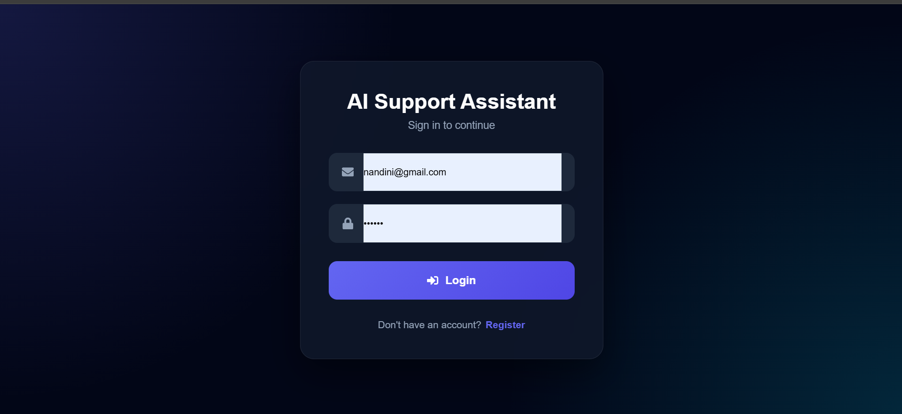
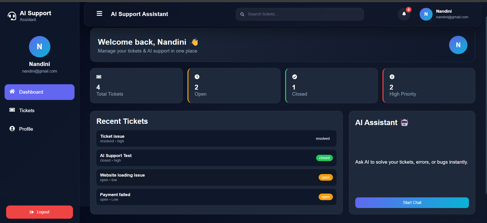
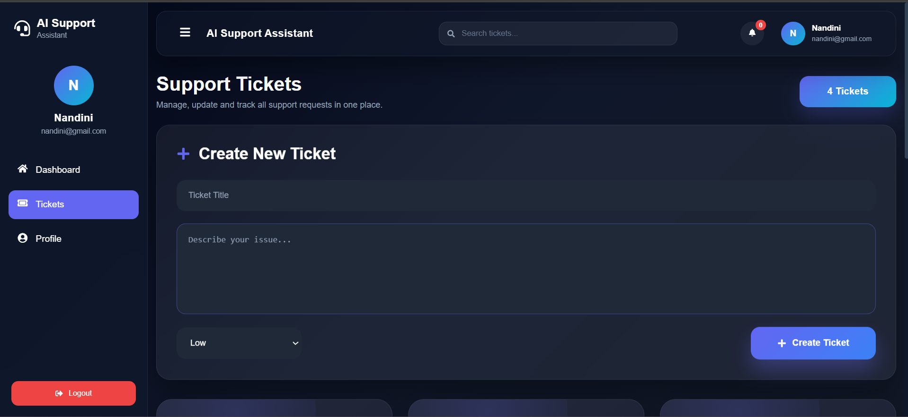
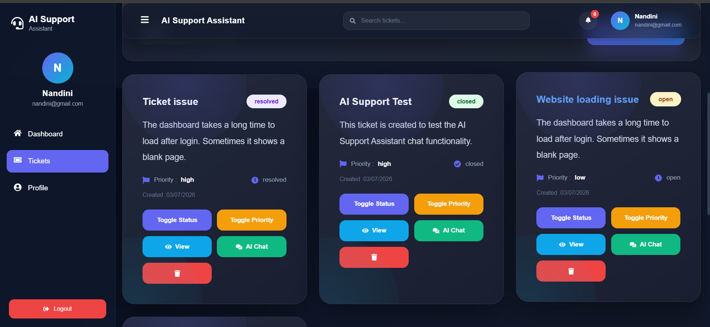
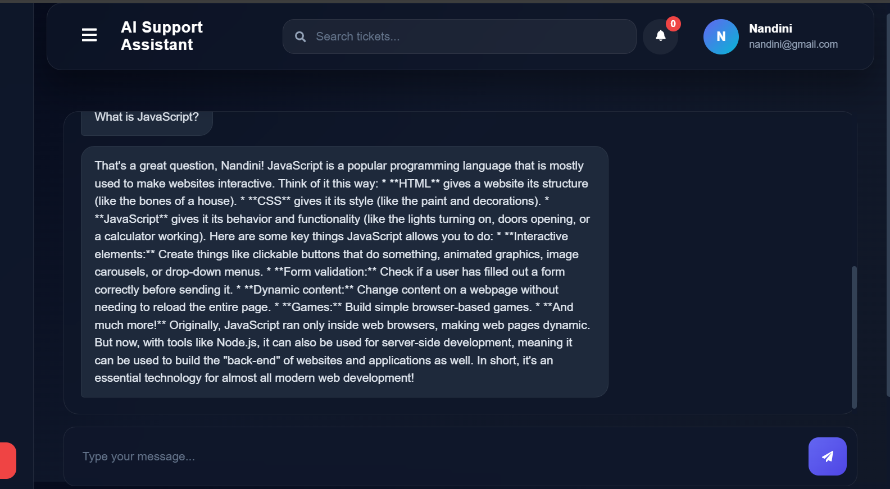
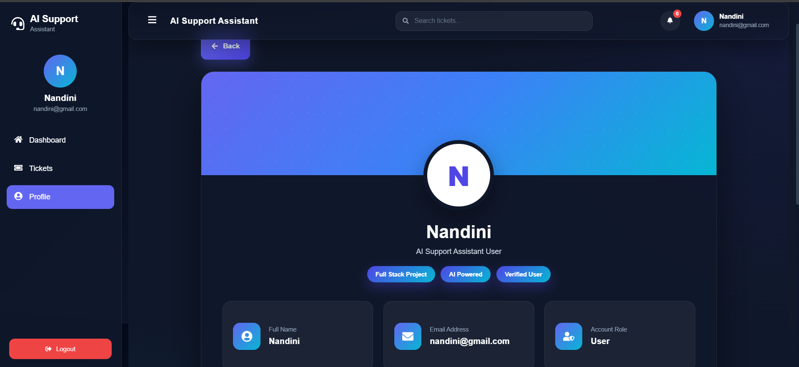

# 🤖 AI Support Assistant

<div align="center">


### 🚀 Modern AI Powered Support Ticket Management System

Create • Track • Resolve • Chat with AI

</div>

---

# 📖 About The Project

AI Support Assistant is a modern Full Stack MERN application that helps users create and manage support tickets while receiving AI-powered assistance for troubleshooting and issue resolution.

The application combines:

- 🤖 Artificial Intelligence
- 🎫 Ticket Management
- 💬 Real-Time Communication
- 🔐 Secure Authentication
- 📊 Beautiful Analytics Dashboard

into one professional platform.

---

# ✨ Features

## 🔐 Authentication

- JWT Authentication
- Secure Login
- User Registration
- Protected Routes
- Persistent Login
- Logout System

---

## 🎫 Ticket Management

- Create Ticket
- View Tickets
- Update Status
- Update Priority
- Delete Ticket
- Search Tickets
- Filter by Status
- Filter by Priority
- Ticket Details Page

---

## 🤖 AI Assistant

- AI Chat for every Ticket
- Smart Suggestions
- Error Explanation
- Debugging Help
- Programming Assistance
- Issue Resolution
- Google Gemini Support
- OpenAI Ready

---

## 📊 Dashboard

- Total Tickets
- Open Tickets
- Closed Tickets
- High Priority Tickets
- Recent Tickets
- AI Quick Access
- Search Support
- Responsive Cards

---

## 👤 Profile

- User Information
- Email
- Initial Avatar
- Clean UI
- Professional Design

---

## 🌐 Real Time Features

- Socket.io Integration
- Live Messages
- Instant Updates
- AI Response Streaming Ready

---

# 🎨 Modern UI

✔ Professional Dashboard

✔ Responsive Sidebar

✔ Animated Cards

✔ Glassmorphism Design

✔ Gradient Buttons

✔ Beautiful Forms

✔ Ticket Analytics

✔ Mobile Responsive

✔ Professional Footer

✔ Modern Navigation

---

# 🧠 AI Capabilities

- Answer User Questions
- Programming Help
- Bug Fix Suggestions
- Ticket Resolution
- Technical Guidance
- Error Explanation
- Smart Responses
- AI Conversation History

---

# 🏗 Tech Stack

## Frontend

- React.js
- React Router DOM
- Axios
- React Icons
- CSS3
- Context API
- Socket.io Client

---

## Backend

- Node.js
- Express.js
- MongoDB
- JWT
- bcrypt
- Socket.io
- dotenv
- CORS

---

## AI

- Google Gemini API
- OpenAI API (Ready)

---

# 📂 Project Structure

```
AI-SUPPORT-ASSISTANT
│
├── backend
│   │
│   ├── src
│   │   ├── config
│   │   ├── controllers
│   │   ├── middlewares
│   │   ├── models
│   │   ├── routes
│   │   ├── services
│   │   ├── utils
│   │   └── app.js
│   │
│   ├── server.js
│   └── package.json
│
├── frontend
│   │
│   ├── src
│   │   ├── api
│   │   ├── assets
│   │   ├── components
│   │   ├── context
│   │   ├── layouts
│   │   ├── pages
│   │   ├── routes
│   │   ├── App.jsx
│   │   └── main.jsx
│   │
│   └── package.json
│
└── README.md
```

---

# ⚙ Installation

## Clone Repository

```bash
git clone https://github.com/yourusername/ai-support-assistant.git
```

```
cd ai-support-assistant
```

---

# Backend Setup

```
cd backend
```

Install Packages

```bash
npm install
```

Create **.env**

```env
PORT=5000

MONGO_URI=your_mongodb_connection

JWT_SECRET=your_secret_key

AI_PROVIDER=gemini

GEMINI_API_KEY=your_gemini_api_key

OPENAI_API_KEY=your_openai_key
```

Run Backend

```bash
npm run dev
```

---

# Frontend Setup

```
cd frontend
```

Install Packages

```bash
npm install
```

Run

```bash
npm run dev
```

---

# 📊 Dashboard

The Dashboard provides:

- 📈 Total Tickets

- 🔓 Open Tickets

- ✅ Closed Tickets

- 🔥 High Priority

- 📝 Recent Tickets

- 🔍 Search

- 🤖 AI Quick Chat

---

# 🎫 Ticket Workflow

```
Create Ticket

        ↓

Ticket Created

        ↓

Open AI Chat

        ↓

Ask AI Questions

        ↓

Update Status

        ↓

Resolve Issue

        ↓

Close Ticket
```

---

# 🔐 Authentication Flow

```
Register

↓

Login

↓

JWT Token

↓

Protected Routes

↓

Dashboard

↓

Logout
```

---

# 🤖 AI Workflow

```
User Question

↓

Backend API

↓

Gemini / OpenAI

↓

AI Response

↓

Saved to Database

↓

Displayed in Chat
```

---

# 📱 Responsive Design

Supports

- 💻 Desktop

- 💻 Laptop

- 📱 Mobile

- 📱 Tablet

---

# 🚀 Future Improvements

- Email Notifications

- File Uploads

- Admin Dashboard

- Ticket Categories

- AI Auto Classification

- Voice Support

- Push Notifications

- Dark / Light Theme

- Analytics Charts

- Docker Deployment

- Kubernetes Ready

- CI/CD Pipeline

---

# 📷 Screenshots

Add screenshots here:

```
## 📸 Application Screenshots

### 🔐 Login



---

### 📊 Dashboard



---

### 🎟️ Create Tickets



---

### 🎫 Tickets



---

### 🤖 AI Chat



---

### 👤 Profile



```

---

# 🌟 Learning Outcomes

This project demonstrates knowledge of:

- MERN Stack

- REST APIs

- JWT Authentication

- AI Integration

- MongoDB

- Express

- React

- Node.js

- Socket.io

- Responsive Design

- API Integration

- State Management

- Full Stack Development

---

# 💼 Resume Keywords

- MERN Stack

- React

- Node.js

- MongoDB

- Express

- JWT

- Socket.io

- Gemini API

- OpenAI

- REST API

- Authentication

- AI Chatbot

- Full Stack Development

---

# 👩‍💻 Author

## ❤️ Nandini Panyala

Full Stack Developer

AI Enthusiast

MERN Stack Developer

Open Source Learner

---

# 📄 License

This project is intended for learning, portfolio and educational purposes.

---

<div align="center">

## ⭐ If you like this project, give it a Star ⭐

Made with ❤️ by **Nandini Panyala**

### © 2026 Nandini Panyala

# 🚀 All Rights Reserved 🚀

</div>